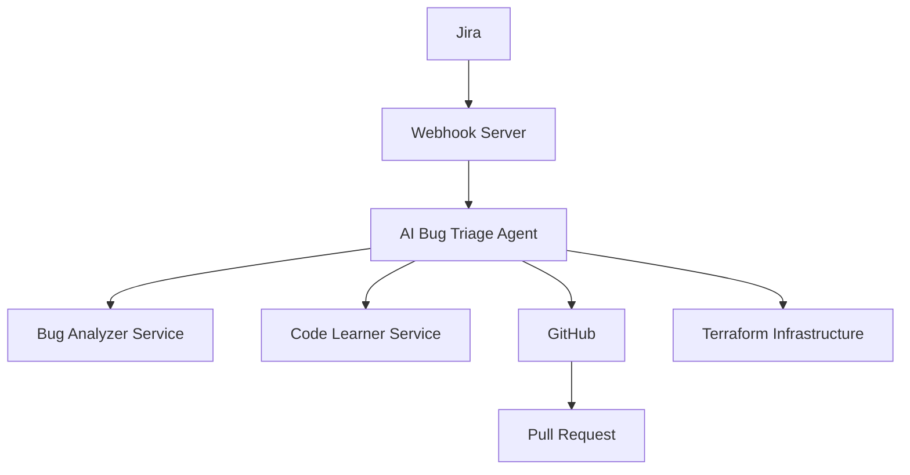

# ai-bug-triage-agent

This project provides an AI-driven bug triage agent. The agent receives bug tickets from Jira via webhook, analyzes the code base, suggests fixes, and creates code reviews in GitHub. Infrastructure can be provisioned with Terraform, and the agent learns from reviewer feedback.


## Features
- **Jira Integration** – Process new bug issues delivered via Jira webhook events.
- **Code Analysis** – Analyze bug titles and descriptions with an open source language model and locate affected files using the GitHub code search API to generate a suggested fix.
- **Version Control Support** – Connect to GitHub and create pull requests automatically.
- **Learning** – The agent remembers past tickets and reviewer feedback to improve future suggestions.

## Running the Agent

First install the Python dependencies:

```bash
pip install -r requirements.txt
```

Configuration is handled entirely via environment variables. Copy `.env.example` to `.env` and fill in the appropriate values:

```
cp .env.example .env
# edit .env with your editor of choice
```

The variables include:

- `JIRA_URL`, `JIRA_USER`, `JIRA_TOKEN`, `JIRA_PROJECT` – Jira connection details.
  Jira project keys are typically uppercase; any extra whitespace will be
  stripped automatically when querying issues.
- `GITHUB_REPO` and `GITHUB_TOKEN` – repository and token used for creating pull
  requests.
- To provision infrastructure with Terraform, set `TERRAFORM_DIR` to the
  directory containing your Terraform configuration.
- To listen for new bugs over a WebSocket, set `JIRA_WS_URL` to the
  endpoint providing bug create events.
- `PORT` and `HOST` allow configuring the webhook server's port and host.
- `HF_MODEL` specifies the Hugging Face model used for code analysis (defaults to `gpt2`).

Run the agent and the variables in `.env` will be loaded automatically:

```bash
python -m ai_agent
```

If `JIRA_WS_URL` is defined, the agent connects to that WebSocket and
processes bugs as they are reported instead of fetching them from Jira.

## Webhook Server

To run a persistent server that handles Jira webhook events, set the desired
`PORT` (defaults to `8000`) and optional `HOST` (defaults to `0.0.0.0`) and
start:

```bash
python -m ai_agent.webhook_server
```

Configure your Jira project to send "issue created" webhooks to the `/webhook`
endpoint of this server. The handler accepts `POST` (and optional `GET`) requests
and only processes issues of type **Bug**. Incoming payloads are handled
immediately by the agent.

### Exposing the Webhook Server with Cloudflare

If you need a public URL while developing locally, you can use
[Cloudflare Tunnels](https://developers.cloudflare.com/cloudflare-one/connections/connect-apps/)
to proxy your running server. Start the server as shown above, then in another
terminal run:

```bash
cloudflared tunnel --url http://localhost:8000
```

The command prints an address like `https://<something>.trycloudflare.com`.
Use that URL followed by `/webhook` in your Jira configuration:

```
https://<something>.trycloudflare.com/webhook
```

The tunnel stays active only while `cloudflared` is running and provides a
convenient static endpoint for testing.


## Terraform Infrastructure

Infrastructure is created with Terraform using the
`TerraformInfrastructure` helper in `ai_agent/terraform_infra.py`. Set the
`TERRAFORM_DIR` environment variable to a directory containing Terraform
configuration files. The helper will run `terraform init` and `terraform apply
-auto-approve` prior to running the agent.

## Learning from Tickets and Code

The agent can build a small memory of past bug tickets and their fixes using open source models.
Steps to enable this feature:

1. Install the additional requirement `numpy` listed in `requirements.txt`.
2. Set `MEMORY_FILE` to the path where the agent should store its knowledge (defaults to `memory.json`).
3. Optionally set `MEMORY_MODEL` to a Hugging Face model for embedding bug text (defaults to `distilbert-base-uncased`).
4. Run the agent as usual. After each bug is processed, the ticket text and generated patch are stored.
5. When a new ticket arrives, the analyzer searches the memory for similar issues and reuses the stored solution when one is found.

This simple memory grows over time and helps the agent suggest fixes based on previous reviews.

## Notes
The project includes working integrations with Jira, GitHub, and Terraform. Provide your own credentials to enable each connector. The analysis and learning components use open-source models.


## Microservices

Two lightweight services demonstrate how the agent's responsibilities can be split into dedicated components:

- `code_learner_service` – stores code snippets so other tools can reference them when analyzing bugs.
- `bug_analyzer_service` – wraps `CodeAnalyzer` and exposes endpoints for bug analysis and learning from reviewer feedback.

Run each service with `python service.py` in its directory. By default the code
learner listens on port `5001` and the bug analyzer on port `5002`.

To run the services simultaneously use separate terminals:

```bash
# Terminal 1: code learner
cd code_learner_service
python service.py               # or PORT=6001 python service.py

# Terminal 2: bug analyzer
cd bug_analyzer_service
python service.py               # or PORT=6002 python service.py
```

## System Design
The following diagram illustrates the overall architecture of the bug triage system.


